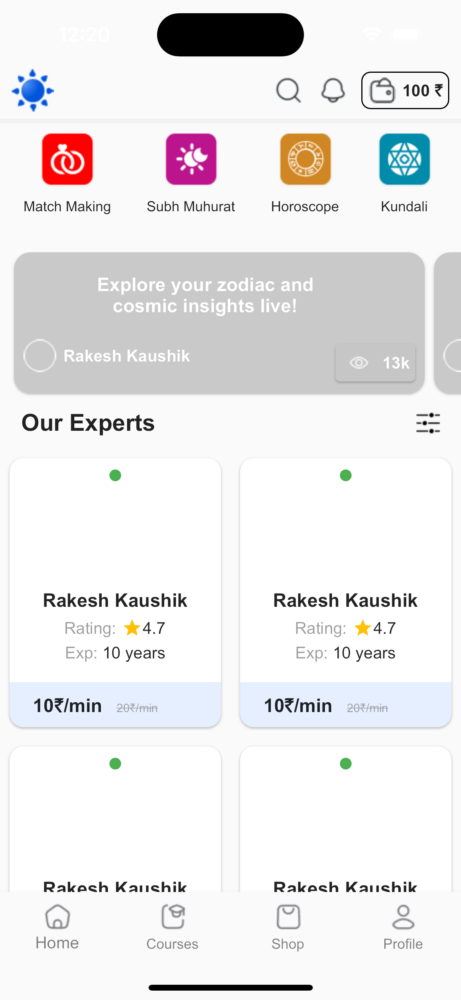
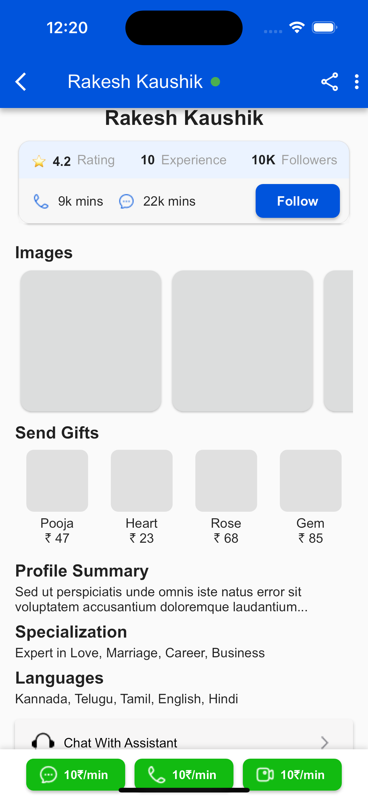

# AstroApp

A clean and responsive Flutter UI for displaying an expert's profile with rating, experience, followers, and interaction options like chat, call, and video.

## Features

- AppBar with expert name and online status
- Bottom buttons for Chat, Call, and Video
- Profile details (Rating, Experience, Followers)
- Interaction stats (chat/call minutes)
- Follow button
- Horizontal image gallery
- Profile summary, specializations, and languages
- Chat with Assistant button
- User reviews section

## Tech Stack

- Flutter
- Dart

## How to Run

1. Clone the repository
`git clone https://github.com/bhartisahu09/AstroApp`

2. Install dependencies
`flutter pub get`

3. Run the app
`flutter run`

### Home Screen  

### Details Screen  

## Getting Started

This project is a starting point for a Flutter application.

A few resources to get you started if this is your first Flutter project:

- [Lab: Write your first Flutter app](https://docs.flutter.dev/get-started/codelab)
- [Cookbook: Useful Flutter samples](https://docs.flutter.dev/cookbook)

For help getting started with Flutter development, view the
[online documentation](https://docs.flutter.dev/), which offers tutorials,
samples, guidance on mobile development, and a full API reference.
